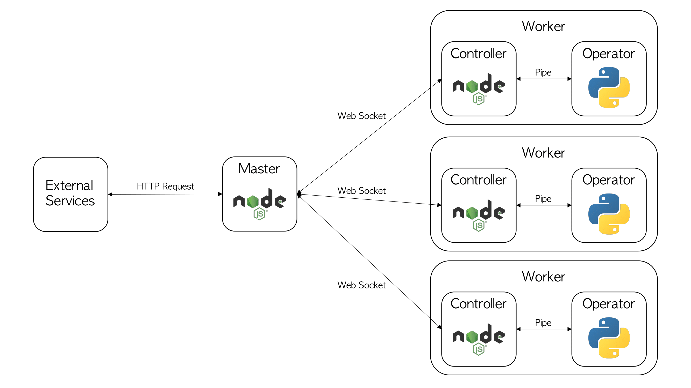

# Cluster Network V1

#### This project is deprecated and will be replaced by [Cluster Network V2](https://github.com/rulyox/cluster-network-v2).

Simple Node.js implementation of baseline cluster network using Master & Worker architecture.

## Usage

This can be used in situations where multiple servers are needed (ex. ML model serving).

Target language (ex. python) can be changed.

## Requirements

* Node.js

```
npm install
```
Run this command for each Master, Worker.

* Use process managers such as PM2 for continuous service.

## Terminal Commands

### Master
```
node index.js --port 8888
```
```
pm2 start index.js -- --port 8888
```

### Worker
```
node index.js --port 8801 --password "a1b2c3d4" --python_bin "/usr/bin/python3" --python_exe "./python/sample.py"
```
```
pm2 start index.js -- --port 8801 --password "a1b2c3d4" --python_bin "/usr/bin/python3" --python_exe "./python/sample.py"
```

## Architecture



### Masters

Master processes all external queries and manage all Workers by communicating with Controllers.

Only one Master exists.

### Worker

Each Worker is consisted of Controller and Operator.

### Controller

Controller directly manages the Operator process and reports the status to Master.

### Operator

Operator is the process which do the actual calculations. (ex. python)

## Protocol
1. Workers open socket servers.
2. Master connects to Worker sockets.
3. Worker's initial state is 'invalid'.
4. Controller spawns Operator process. When spawning is done, change state to 'valid'.
5. When a client sends a request, Master saves them to a queue.
6. When Master finds a valid Worker, send a task.
7. When Worker receives a task, change state to 'invalid'. After Operator finishes the task, send result to Master and change state to 'valid'.
8. When Master receives a result from a Worker, send response to client.
9. When Operator makes an error, Controller restarts the process.
